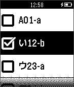
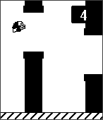
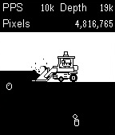
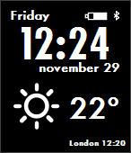
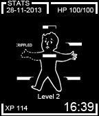
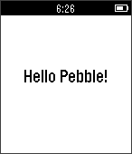
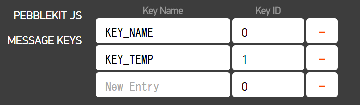
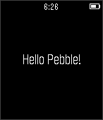

# Pebble入門
　こんにちは。ぼぶ(@Bob_Mk2)と申します。最近、ある界隈でスマートウォッチのPebbleが熱いとのことで、自分も1つ買ってみました。この手のスマートウォッチを買うのは初めてだったのですが、すっかりはまってしまい、ここ何週間はやたらとPebbleにまつわるLTをして布教活動をしている気がします。今回はPebble入門という内容で、Pebbleとは何ぞや？という内容とアプリの開発環境に関して書きたいと思います。

## Pebbleとは

　Pebbleはスマートウォッチの1つです。スタートアップはKickstarterプロジェクトで、2012年の春頃に合計で約1,000万ドルの出資を受けて成功を収めたことから当時話題になりました。
 　他のスマートウォッチと大きく異なる点は白黒ディスプレイが挙げられます。このディスプレイは 144x168ピクセルの電子ペーパーディスプレイを採用しています。そのため、昼間でも見やすく、バッテリーが長持ちです。使う状況にも左右されますが、平均5～7日は充電をしなくても利用できる特徴を持ちます。自分の場合、更新頻度の低い時計盤を付けて生活した場合は約10日ほどバッテリーが持ちました。LED バックライトを使うと電池消耗が結構激しいらしく、夜間にPebbleを着けて自転車に乗っていたら、あっという間に電池が無くなった(原因は、夜間は振動を与えるとバックライトが点くため)、とPebbleユーザの先輩から聞きました。ちなみにバックライトの設定は設定画面から変更可能なのでPebbleを着けて夜間自転車に乗る場合などはオフにすることをおすすめします。

### Pebbleと親機

　PebbleはBluetooth連携している親機(AndroidやiPhone)の通知を表示することができます。メールの受け取りや、電話の着信、Twitterのリプライ通知など多くの通知を受け取ることができるのでとっても便利です。メールの着信通知の場合だと、Pebbleのディスプレイ上にはメールのタイトルと本文が表示されますが、ファームウェアv2.8時点ではまだ日本語には対応していないため、ほとんどが豆腐で表示されます。日本語を表示したい場合には有志の方が作られた[Pebble 日本語ファームウェア](http://www.texpress.co.jp/pebble_hiragana)をインストールすることで800字までの日本語を表示することができます。
　Pebbleはネットワークに接続することができないため、それ単体では時計としての機能しか持ちません。親機(AndroidやiPhone)とBluetooth接続し、連携することでスマートウォッチのとしての機能を利用することができます。親機がPebbleと連携するためには、Pebbleの公式アプリをインストールする必要があります。この公式アプリ上から、Pebbleアプリのインストールやファームウェアのアップデートを行います。親機がPebbleの近くにないとPebbleは親機からの通知は受け取れません。また、天気情報などネットワークを通して取得する必要がある情報も親機が繋がっていないと更新されなくなるため注意が必要です。

### Pebbleアプリ

　PebbleにはWatchapp(ゲームや便利アプリなど)とWatchface(時計盤)の2種類のPebbleアプリをその時計の中にインストールすることができます。インストールする場合には、親機の公式アプリ上から確認できるアプリ投稿サイトを経由するか、野良で配布されているものを拾ってくる必要があります。Pebbleアプリはpbzかpbw形式で配布されていて、Pebble公式のモバイルアプリをインストールした親機からアプリファイルをダウンロードすることで、Pebble本体にインストールすることができます。
　1つのPebbleには最大で8つのPebbleアプリまで入れることができます。8個だと少し物足りない感じがしますが、ロッカーという仕組みを親機側の公式アプリがサポートしているため、使わなくなったアプリはロッカーにしまっておくことができます。再びインストールしたくなった際には、ロッカーからアプリを取り出してPebbleにインストールすることができます。

#### Watchapp
　Watchappはゲームや便利ツール機能を持つアプリです。キー入力が取れることから、何かをリスト表示して選択操作させる、といったユーザ操作を求めるものが多いです。Watchappはアラーム設定や通知設定への動線となるメニュー画面に追加されるので、そこ経由でWatchappを利用します。また、ゲームも豊富に存在します。Pebbleでゲームはそもそも操作性にどうなのよ、と思うかもしれませんが、パズルゲームなどユーザ操作を逐一待つようなゲームは問題ありませんでした。また、クッキークリッカーのような放置系ゲームもあり、相性の良さを感じました。少し余談ですが、メニュー画面でPebble本体のセンターボタンを長押しすると並び替えができるので、頻繁に使うようなアプリの場合は上のほうに並び替えると使い勝手が良くなります。
 　[Evernote](http://blog.evernote.com/blog/2014/03/07/evernote-go-introducing-evernote-pebble/)もPebbleに対応しており、Pebble上からノートブックの確認やチェックリストを使うことが可能です。日本語ファームを入れていたとしても対応文字数の関係から、Pebble上で利用する前提のノートブックやチェックリストを作る場合には、ひらがなやカタカナだけを使うか、日本語を使わずに書いたほうがよいかもしれません。コミケのサークル場所は幸いにも日本語ファームに含まれる文字で表現可能なので捗る感じはしますね。ファーム内に「東西」の漢字が含まれていないのは少し残念ですが…。



　どこのプラットフォームにいっても必ずといっていいほど存在するFlappy Birdクローンですが、Pebbleも例外ではありません。[Tiny Bird](https://apps.getpebble.com/applications/52f7a04b777f7eee6d000258)はFlappy Birdクローン系ゲームでPebble上でボタン1つでFlappy Birdのようなゲームを遊ぶことができます。電車の待ち時間であったり、コーヒーを入れている間などちょっとした待ち時間にどうぞ。



　[PIXCEL MINER](https://apps.getpebble.com/applications/539e18f21a19dec6ca0000aa)はクッキークリッカのような放置系ゲームです。放っておくと勝手にピクセルを掘っていきます。最初はその掘ったピクセルを使い、より良い装備や、採掘スピードを強化してPPS(Pixcel per Seconds)を上げていきます。最初は手で掘っていますが、シャベルやドリルマシンなど装備品を変えると掘る人の見た目も変わるため、見ていても楽しめます。また、採掘中に宝石などを発掘することもあり、それらを売ってピクセルを得ることができます。アプリを起動していない時でも勝手に採掘していることになるので、放置していれば勝手にピクセルは貯まっていきます。



#### Watchface
　Watchfaceはその名の通り時計盤としての機能を持つアプリです。時刻や日時の基本表示するものが一般的ですが、その基本情報に天気や気温の情報を表示するものは使い勝手がいいです。他にはアナログ風に見せるものや、とある団体から怒られそうなものなど色々とあります。Pebble上では上下ボタンでWatchfaceを簡単に切り替えることができます。そのため、複数のWatchfaceをPebbleにインストールし、機能や気分に合わせて時計盤の見た目を切り替えると楽しく使えると思います。
　[YWeather](http://www.mypebblefaces.com/apps/9518/7807/)は、時計や残バッテリー量といった基本情報の他に、天気や温度を教えてくれる使い勝手の良いWatchfaceなのでPebbleに入れて使っています。バックグラウンドで、親機のGPSを使ってYahoo!天気から現在地の天気情報を取得しており、30分毎に更新されます。



　[Pip Boy 100](http://www.mypebblefaces.com/apps/12530/7925/)は、一見、基本的な情報しか表示されませんが、Falloutシリーズを遊んだことがある人にとってはどこか惹かれるものがあるのではないでしょうか。自分もその一人です。腕を振ると天気情報の確認もできます。また、オプションとして、歩くと経験値が貯まるようになっていて左下のXPの部分の値が少しずつ増えていきレベルアップしていくことができます。レベルアップしても特に見た目以外に意味はありませんが、使っていて面白いのでとにかく良しです。



## 開発環境

　PebbleはSDKを公開しているため、ユーザはそれを使って自分の望むアプリを作りやすい環境にあります。後述しますが、クラウド上での開発も可能としているため、開発環境の導入であれこれ悩んでやる気ゲージが下がるのを防ぐこともできます。PebbleアプリはWatchappとWatchfaceの2種類があることは前述しましたが、開発する上ではWatchappとWatchfaceの区別はほとんどありません。大きな違いはボタン入力を取れるかどうかに依っていて(Watchappはボタン入力が取れます)、開発途中で値を1つ変更するだけで切り替えることができます。
 　Pebble本体側で動作するコードはC言語、親機側はJavascriptで書くのが一般的ですが、[Simply.js](http://simplyjs.io/)や[Pebble.js](http://pebble.github.io/pebblejs/)の登場でPebble本体側で動作するコードもJavascriptで書けるようになりました。ここでは、Pebble 2.x以降のアプリを開発する場所と、開発方法を主に取り上げたいと思います。

### 開発する場所

　Pebbleアプリを開発する場所は大きく分けて2つから選択できます。1つはローカル、もう1つは[CloudPebble](https://cloudpebble.net/)です。CloudPebbleはクラウド上で開発ができ、開発環境をローカルに整える必要がなくなるため、初めてPebbleアプリを開発する際にはCloudPebbleから触ってみることをオススメします。

#### CloudPebbleとは

　Pebbleのアプリ開発をブラウザ上のIDEを使って開発することができるサービスです。公式のドキュメントを読んでるとCloudPebbleを使うことをすごくプッシュされるので公式サービスのように見えますが、生まれたときは有志の方が作ったもののようです。クラウド上で開発するとなると、できないことも多々ありそうに思えますが、基本的にローカル環境でできることはほぼ全てできると思っても問題ないレベルで色々できます。以下にできることを列挙してみます。

* Pebbleのスクリーンショットの撮影
* ビルドログ、実行時ログの確認
* Githubとの連携
* リソース(png画像やフォント)のアップロード
* 入力補完方法の設定
* キーバインドの設定(vim-likeやemacs-likeをサポート)
* エディタのテーマの設定(EclipseやSolarizedなど)
* プロジェクトをまとめたzipのダウンロード

　さくっと何か作る分にはこれ以上のものは無いと思います。

#### それぞれの長所・短所
　ローカルでの開発とクラウド上での開発、両方とも軽くですがトライしてみた結果、それぞれの長所・短所が見えてきたのでまとめてみます。

* ローカル
	* 長所
		* 自分の好きなエディタやIDEを使って開発が可能
		* ビルドや実行の待ち時間がクラウド開発に比べると早い
	* 短所
		* 環境導入時に躓く可能性有り
		* リソースの追加時に直接管理ファイルをいじるため、事故が起きやすい
		* Windowsの場合はVMの導入が必要
* クラウド
	* 長所
		* 導入が容易
		* ローカルに環境を整える必要が無くなる
		* 専用のアップローダページがあるため、リソースの取り扱いが容易
	* 短所
		* サービスが落ちていてまともにコードを書けないときがある
		* ビルドして実行する際に、インジケータダイアログが最前面に出るため開発の手が止まる
		* 外部ライブラリを取り込む仕組みが無いためコピペが必要
		* 親機にビルド結果を流し込む時のログが不十分で、問題が起きた時に対処しづらい
		* 多くのリソースを使う場合、1つ1つアップロードするのが少し面倒
		* Github連携をサポートはしているが、複数人で開発するのには不向き
		* 現在はBitbucketなど他のホスティングサービスを利用できない

　これだけを見ると「じゃあローカルで開発したらいいじゃない！」となるぐらい、クラウド側が不利ですが、個人的には最初はクラウドで作って途中からローカルに切り替えることを推奨します。移行時期は以下の目安を参考にしてみてください。1つ以上該当するのであれば、多少時間がかかってもローカルに開発環境を整えたほうが良いと思います。

* クラウドからローカルへの移行時期の目安
	* クラウド上のIDEに耐えられないとき
	* 開発スピードが必要なとき
	* 外部ライブラリをバリバリ使う必要が出てきたとき
	* 複数人開発する必要が出てきたとき
	* Github以外のホスティングサービスを使いたいとき
	* Pebbleアプリの開発慣れたわーってとき

### 開発方法

　Pebbleアプリを開発する方法はいくつかあります。名前が似ててややこしいものがあるため、先に一覧としてまとめてみます。

<table summary='表1::開発方法まとめ'>
  <tr>
     <th>方法</th>
     <th>説明</th>
  </tr>
  <tr>
     <td>Pebble C SDK</td>
     <td>Pebble本体側で動作するアプリを書くためのSDK。WatchappやWatchfaceをC言語で実装します。</td>
  </tr>
  <tr>
  	<td>Simply.js</td>
    <td>Pebble AppをJavascriptで書けるようにしたフレームワーク。画像の表示など複雑なことは未サポートです。</td>
  </tr>
  <tr>
  	<td>Pebble.js</td>
    <td>Simply.jsと同様のフレームワークですが、よりできることが増えています。今はbeta版です。</td>
  </tr>
　<tr>
     <td>PebbleKit iOS/Android</td>
     <td>iOSやAndroidのアプリの中に組み込むライブラリ。本体で動作するPebbleアプリと連携する際に用います</td>
  </tr>
  <tr>
  	<td>PebbleKit JS</td>
    <td>親機側のPebble公式アプリ上で動作するPebbleKitのJavascript版です。独自のiOS/Androidアプリの開発が不要になります。</td>
  </tr>
</table>

　今回は、Pebbleアプリの開発方法としてメジャーと思われるPebble C SDK + PebbleKit JSとPebble.jsの2つを取り上げます。

#### Pebble C SDK + PebbleKit JS

　今現在、Pebbleアプリを開発する際の一番ベーシックな組み合わせだと思います。本体側で動作するアプリをC言語で記述し、APIを叩いたりネットワーク通信する箇所をPebbleKit JSで記述します。C言語では主にPebble本体のディスプレイに画像や文字を表示する部分を記述することになります。C言語をあまり触ったことがない自分でも素直に記述することができました。「作ったらちゃんと消す！」というのは久しぶりに触ると忘れがちで少し痛い目は見ましたが…。
　PebbleKitにはJS版以外にもiOS/Android用に組み込み用のライブラリが公開されています。自前のモバイルアプリを既に持っている場合にはそのライブラリを組み込むことで、Pebble本体と連携することが可能になります。しかし、いちいち1つのPebbleアプリごとに対応する1つのモバイルアプリを作るのは非常に面倒くさいです。PebbleKit JSを使うと、親機のPebbleアプリと連携する部分をJavascriptで書けるだけでなく、iOS/AndroidのPebble公式アプリで実行されるため、モバイルアプリの用意や配布をする必要が無くなり、個人で開発する上では嬉しい事が多いです。
　UIは基本的にはウィンドウとレイヤーと呼ばれる仕組みを使います。根本にあるウィンドウのレイヤーに別のレイヤーを乗せていき1つの画面を構築します。例えば、画面の上に文字列を表示する場合には、以下のように記述します。一見癖があるように見えますが、少し書いてみるとすぐ慣れると思います。

```C
// Pebble C SDKで文字列と画像を描画する例
// 宣言
Window *window;
TextLayer *text_layer;
// ~~~~~
// 初期化と配置
window = window_create();

text_layer = text_layer_create(GRect(0, 50, 144, 30));
text_layer_set_text(text_layer, "Hello Pebble!");
text_layer_set_font(text_layer, fonts_get_system_font(FONT_KEY_GOTHIC_24_BOLD));
text_layer_set_text_alignment(text_layer, GTextAlignmentCenter);

layer_add_child(window_get_root_layer(window), text_layer_get_layer(text_layer));
// ~~~~~
// 後始末
text_layer_destroy(text_layer);
window_destroy(window);
```


　Pebble本体と親機間でデータのやりとりはAppMessageという仕組みを用います。Pebbleアプリから定期的に情報更新の要求を飛ばし、本体側でAPIを叩きその結果をPebble本体側に渡すといった流れになります。やりとりはKey-Valueのペアで作られたメッセージ(Dictionaryと呼ばれます)を用いて、Pebble本体と親機側アプリの間で行われます。
　キーの部分はC言語とJavascript側の両方で握り合う必要があるため、appKeysとして設定ファイルに記述します。CloudPebbleだと専用のインターフェースが用意されています。
```json
// ローカルで開発している際は appinfo.json に記述
"appKeys":{
	"KEY_NAME": 0,
    "KEY_TEMP": 1
}
```



　Javascript側では、PebbleKit JSによってキーの名前と値がマッピングされているため、以下のようにメッセージを作ることができます。

```javascript
var dictionary = {
	"KEY_NAME" : "tokyo",
    "KEY_TEMP" : 24
};
```

　今のところ互いに渡せるものは、string、int8、int16、int32、uint8、uint16、uint32、byte配列となっています。文字列の配列を渡したいところですが、今はサポートされていないため、;区切りで結合した文字列を渡して、受け取った側で分解するなどの対策が必要です。

#### Pebble.js

　Pebble.jsはPebbleアプリを全てJavascriptのみで記述できるようにしたフレームワークです。PebbleKit JSと名前が似ていますが全く別物です(検索ビリティが低いのが辛い！)。親機側で動作するため、位置情報の取得やインターネット接続も可能で、またメモリに関してもほぼ無尽蔵に使えます。Pebble C SDK+PebbleKit JSのときのようにC言語とJavascriptの複数の言語を用いてコードを書かなくても良いという利点や、Javascriptを使ってモダンな感じでPebbleアプリを作ることができる利点があります。C書くの辛い！という方はPebble.jsから初めて見るのもいいかもしれません。
　Pebble.jsでは、ウィンドウとエレメントを組み合わせてUIを構成します。例えば、画面の上に文字列を表示する場合には、以下のように記述します。Pebble C SDKのときと比べてみると、やっていることは同じでも大分モダンに書けることが分かると思います。ちなみに背景色や文字色がPebble C SDKのときと白黒が真逆なのは、Pebble C SDKは白地に黒字を書くようなデフォルト値を設定しているのに対し、Pebble.jsではその逆になっているためです。なぜ統一しないのかちょっと不思議なところです。

```javascript
// Pebble.jsで文字列と画像を描画する例
var _window = new UI.Window();
var text = new UI.Text({
	position  : new Vector2(0, 50),
    size	  : new Vector2(144, 30),
	font	  : 'gothic-24-bold',
	text	  : 'Hello Pebble!',
    textAlign : 'center'
});
_window.add(text);
```



　Pebble.jsはオープンソースとして公開されているので、詳しく知りたい方は目を通してみるのもいいかもしれません。ざっと目を通した感じでは、Simply.jsを拡張したものを内包していて、Pebble SDK C側で生えている各インターフェースごとに対応する命令をJavascript側から投げることで、C言語での記述を不要にし、Javascriptだけでアプリのコードを書けるようにしているようでした。
　Pebble.jsを利用する際は、(2014年12月半ばの時点で)β版という点に注意してください。そのため、APIが突然変わる可能性があります。また、ネイティブ(C言語)で書く場合と比べると入力レスポンスが悪いのが体感できるレベルだったので、高い入力レスポンスを要求するゲームを作るのにも向いていないと思います。今Pebble.jsを使う場合には少し注意して使ってください。

#### おわりに

　ぜんぜん綺麗にまとまっていませんが、ざっくりとPebbleに関して書いてみました。公式や有志の方による開発チュートリアルも整っているので最初に何か作ってみたくなった時は、そこから始めてみると良いと思います。公式チュートリアルの中でも天気情報を取得してPebble上に表示するところまでやるので、結構やりごたえがあります。オススメは、[公式のWatchfaceチュートリアル](http://developer.getpebble.com/getting-started/watchface-tutorial/part1/)から、有志の方が書いた[SDK 2.0チュートリアル](http://ninedof.wordpress.com/pebble-sdk-tutorial/)をやってみるルートです。両方ともPebble  C SDK + PebbleKit JSでの開発を対象としたチュートリアルなので、Pebble.jsからやってみたい方は[公式のPebble.jsチュートリアル](http://developer.getpebble.com/getting-started/pebble-js-tutorial/part1/)をやってみると、Pebble.jsの基本部分は大丈夫になると思います。
 　これを読んでPebbleに興味を持った方はぜひ買って愛でてみてください(通常版は99ドル、スチール版は199ドル)。発送方法にも依りますが注文してから10日以内には手元に届くと思います。ここ最近の値引きっぷりから近いうちにPebble 2が出るのでは？という噂もあります。今のところ2に関する告知は特にありませんが、なんだかワクワクしますね。フルカラーになると嫌なフラグが立ちそうなので、Pebbleにはぜひ白黒のまま突き進んでもらいたいものです。それでは、失礼します！
