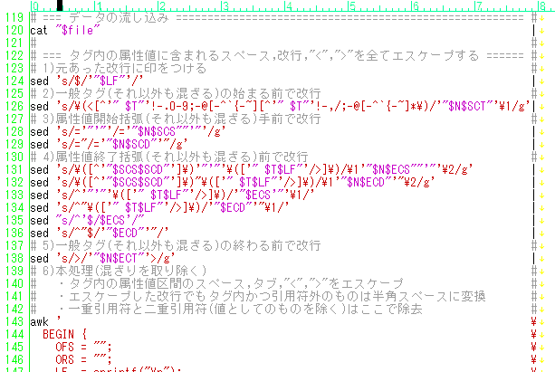
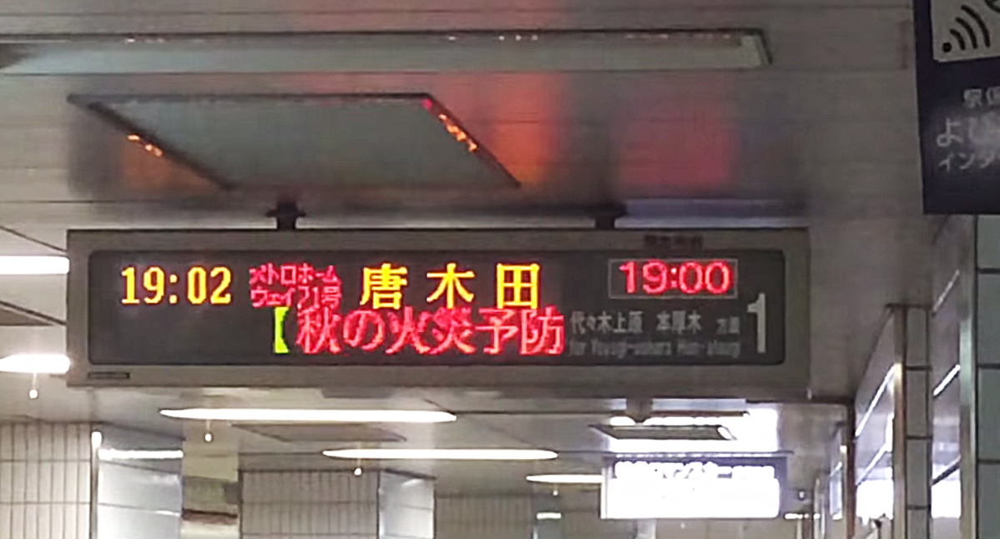
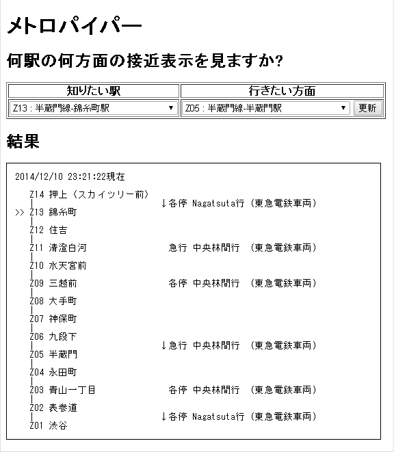
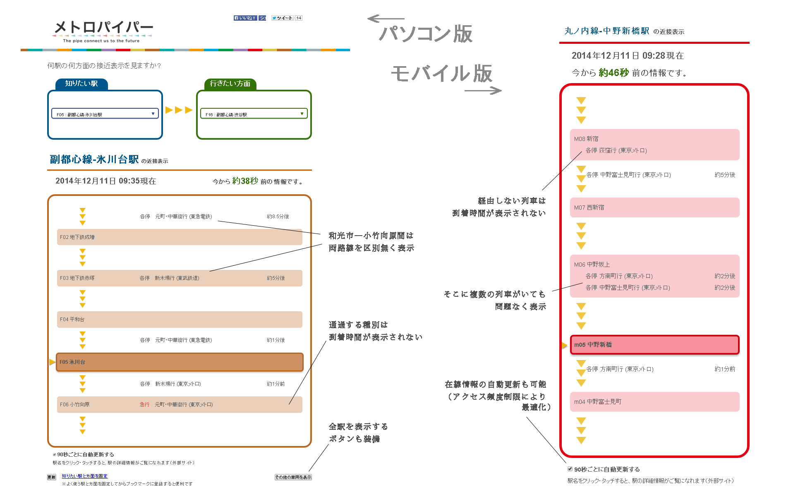
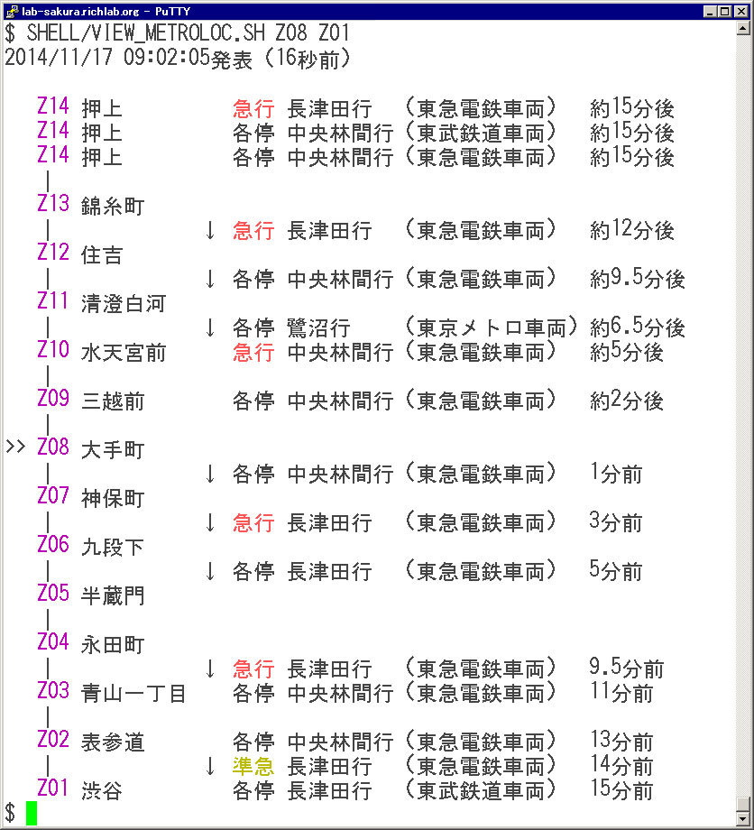

Title: 恐怖！メトロパイパー男
Subtitle: パイプを駆使して東京メトロを侵略せよ
Author: @richmikan
Author(romaji): richmikan

# お前たち夏コミで洗脳されたか？


世界70億の人間どもよ、また会ったな。私は偉大なるPOSIX原理主義集団「秘密結社シェルショッカー」日本支部のリッチー大佐である。夏コミで見せてやったシェルスクリプト製ショッピングカートにして我日本支部の怪人第一号である「シェルショッカー1号男」で、さぞ洗脳されたことであろう。幸いにして我々の前には「正義の味方」なる宿敵もおらん。シ○ッカーという組織は、改造人間を作る際、身体の改造を先にやって洗脳作業を後回しにしたからな。だから滅びおったわけだ。洗脳を先にやっておけばよいものを……。

これを読んでいるお前たちはとっくに洗脳されておるな。……なに、今何と言った!!……むむ、まだ洗脳が足りんようだな。いいだろう。お前たちに今から、我組織が改造して造り上げた第二の怪人、恐怖！「メトロパイパー男」を見せてやる。これは、「オープンデータ活用コンテスト」開催と称してまんまと路線データを公開しおった東京メトロを侵略するための怪人。今度こそ確実に洗脳されるはずだ。ワッハッハッハ！

# 序章. 我組織が誇る三つの兵器

シェルショッカー1号男の開発の時には出番がなかったが、POSIX原理主義を貫く我々組織には三つの兵器があるのだ。これは日本支部のみならず、世界中の支部に配備されている。教えてやろう。それはCSVデータ、JSONデータ、そしてXMLデータを解析するパーサーだ。今世界にはこれらのテキストデータが溢れている。人間どもがやりとりをするこれらのデータを傍受し、世界征服への次なる一手を日々考えているのだよ。

恐怖！メトロパイパー男を見せる前にその、パーサー(先にソースコードが見たいならGitHubに置いてあるから見るがいい。URLは`https://github.com/ShellShoccar-jpn/Parsrs`だ。)の威力を見せてやろう。

## jqやxmllintに首領様が怒った

CSVの話は置いておくが、JSONテキストのパースならjqというコマンドが、そしてXMLテキストのパースならxmllint、hxselect(W3Cが出している“HTML-XML-utils”というユーティリティーに収録されている。)、xpath(MacOS Xにあるコマンド)といったものが既にある。だが、我組織の首領様はそのどれもがお気に召さなかった。「POSIX原理主義者が身に付けておくべきUNIX哲学を無視している」とお怒りになった。理由は次のとおりだ。

### 理由1. 一つのことをうまくやっていない

UNIX哲学の一つとしてよく引用されるマイク・ガンカーズの教義(「UNIXという考え方―その設計思想と哲学」を読むがいい。)に

1. 小さいものは美しい。
2. 1つのプログラムには1つのことをうまくやらせよ。

というのがあるが、まずこれができておらん。jqやxmllint等は、データの正規化（都合の良い形式に変換する）機能とデータの欲しい部分だけを抽出する部分抽出機能を分けていない。むしろ前者をすっ飛ばして後者だけやっているように見える。

だがUNIX使いとしては**部分抽出といったらgrepやAWK**を使い慣れているわけで、それらでできるようにしてもらいたいのだよ。部分抽出をするために、**jqやxmllint等独自の文法をわざわざ覚えたくもない**。

だから、正規化だけをやるようなコマンドであってほしかった。

### 理由2. フィルターになりきれてない

同じく教義の一つに

9. 全てのプログラムはフィルターとして振る舞うように作れ。

というものがある。フィルターとは、入力されたものに何らかの加工を施して出力するものをいうが、jqやxmllint等は、出力の部分に注目するとフィルターと呼ぶには心もとないのだよ。そうは思わんか？

なぜなら、JSONパーサーはJSONテキストの一部をJSON形式のまま出力し、XMLパーサーはXMLテキストの一部をXML形式のまま出力する。我々は**JSONやXML形式が扱いづらいからパーサーに掛けたいのであって、サブセットを渡されてそれをどーしろと**言うのか！そんなものを標準UNIXコマンドに放り込んでも、どうにも料理できないではないか。AWK、sed、grep、sort、tr……といった**UNIX標準コマンド群は、行単位あるいは列単位（空白区切り）のデータ加工に向いた仕様**になっておるのだ。

というようにUNIX哲学の心を全く理解しておらんのだよ。

## そして兵器は開発された

そこで我組織は秘密裏に、自らの手でパーサー兵器を開発した。使い勝手を揃えたCSVパーサーも併せてな。それがParsrs（パーサーズ）だ。→`https://github.com/ShellShoccar-jpn/Parsrs`

これがいかに優れているか、早速デモしてやる。

### JSONデータをパースする

まず次のようなJSONデータがあったとしよう。会員の商品購入履歴だ。

```
{"会員名" : "文具 太郎",
 "購入品" : [ "はさみ",
              "ノート(A4,無地)",
              "シャープペンシル",
              {"取寄商品" : "替え芯"},
              "クリアファイル",
              {"取寄商品" : "6穴パンチ"}
            ]
}
```

これを我らのJSONパーサー、parsrj.shに掛けるとこうなる。

```
$.会員名 文具 太郎
$.購入品[0] はさみ
$.購入品[1] ノート(A4,無地)
$.購入品[2] シャープペンシル
$.購入品[3].取寄商品 替え芯
$.購入品[4] クリアファイル
$.購入品[5].取寄商品 6穴パンチ
```

JSONのデータ構造は、ファイル・ディレクトリー構造に似ている。後者で重要なものがファイルパスとファイルの中身であるように、JSONも値の場所と値が重要なのだ。幸いJSONには“JSONPath”(`http://goessner.net/articles/JsonPath/`参照)という値の場所を示すための規格があるから、JSONPathと値を1行に並べたデータにすればよい。keyとvalueの2列から構成されるテーブルに変換できたことになる。

### XMLデータをパースする

同じデータがXML形式で表現されている場合も同じだ。例えば次のようなデータになっていたら、

```
<文具購入リスト 会員名="文具 太郎">
  <購入品>はさみ</購入品>
  <購入品>ノート(A4,無地)</購入品>
  <購入品>シャープペンシル</購入品>
  <購入品><取寄商品>替え芯</取寄商品></購入品>
  <購入品>クリアファイル</購入品>
  <購入品><取寄商品>６穴パンチ</取寄商品></購入品>
</文具購入リスト>
```

我らのXMLパーサーにかければこうなる。

```
/文具購入リスト/@会員名 文具 太郎
/文具購入リスト/購入品 はさみ
/文具購入リスト/購入品 ノート(A4,無地)
/文具購入リスト/購入品 シャープペンシル
/文具購入リスト/購入品/取寄商品 替え芯
/文具購入リスト/購入品
/文具購入リスト/購入品 クリアファイル
/文具購入リスト/購入品/取寄商品 ６穴パンチ
/文具購入リスト/購入品
/文具購入リスト \n  \n  \n  \n  \n  \n  \n
```

XMLには、XPathというJSONPath同様(同様というか規格としてはXPathの方が先なのだが。)に値の場所の表現法がある。従ってXPathとその値を1つの行並べればよい。

こうすると何が嬉しかといえば、UNIXコマンドで好きなように料理できるようになるということだ。例えば、店に並んでいない取り寄せ商品の一覧が知りたければ、パース後のテキストデータに対して`grep '取寄商品' parsed_data.txt`などと書けばよい。さらに、それが何個あったか知りたければ`grep '取寄商品' parsed_data.txt | wc -l`と、後ろにパイプでコマンドを繋げばよい。UNIXコマンドとの相性もばっちりではないか。

## Parsrsもまた、パイプで繋いだコマンドの塊

我々はPOSIX原理主義集団であるから、Parsrsの中身ももちろんシェルスクリプトとUNIX標準コマンド群でできておる。嘘だと思うなら、GitHubに上げてあるソースコード飽きるほど眺めるがいい。→`https://github.com/ShellShoccar-jpn/Parsrs` 見よ、このパイプで繋がれたコマンドの塊を！



これまたUNIX哲学の教義だが、

6. ソフトウェアは「てこ」。最小の労力で最大の効果を得よ。
7. 効率と移植性を高めるため、シェルスクリプトを活用せよ。

というのがある。これに基づいて開発された我らのパーサーは、C言語に頼らずともそこそこのスピードが出ておる（マルチコア環境でコア数が多いほど威力が増すのだ。）し、かつC言語で書いたプログラムと違ってコンパイル不要。UNIX系OSでありさえすれば、コピーするだけでどこでも動くぞ。どぅぉーだ、スゴいだろう。わっはっは！

そしていよいよ、恐怖！メトロパイパー男が誕生するのだ。

# 第一章. 東京メトロ、コンテスト開催

2014年9月某日。日本の帝都の高速度交通インフラを握るあの東京メトロが、自社の鉄道網に関するデータをWebAPIを通してオープンデータとして公開し、コンテストを実施すると発表した。発表によれば、公開されるデータの概要は次のとおり。

* 方向（どこ方面行きか）
* 列車番号
* 列車種別（各停、特急、急行、快速、臨時） ※非営業列車（試運転、回送）は公開しない
* 始発駅・行先駅
* 所属会社（どの鉄道事業者の車両か）
* **在線位置**（ホーム、駅間の2区分）
* 遅延時間（5分以上の遅延を「遅延」として表示）
* 列車情報（列車時刻表、運賃表、駅間所要時間、各駅の乗降人員数、女性専用車両）
* 施設情報（バリアフリー情報、駅出入口情報、車両ごとの最寄り施設・出入口案内）

何と！在線位置、つまり列車が今どこを走っているかまで公開するではないか。東京メトロとしては「このデータを使って、人々の役に立つアプリケーションを作ってください」という目的なようだが、我々秘密結社シェルショッカーに目を付けられるとは奴らも運が悪かったな。

よーし、その在線情報を傍受し、我々が東京メトロを、ついでにコンテストを侵略して世界征服の礎にしてやるわ!!! わーっはっはっは。

## WebAPI仕様は単純だった

9月12日。コンテストの応募受付が開始されると同時にWebAPIが公開された、具体的な仕様、そして実データの姿が明らかになったわけだ。

我々は侵略の第一歩として、早速使用方法の解析に入った。アクセスするためには「アクセストークン」なるIDの発行を申請する必要があるということだった。これはTwitterで言うなら独自アプリを作る時に申請する“Application ID”なわけだ。「もしや、APIを叩くにはこのIDでOAuth認証をして……」と思ったのだが、単にアクセス用のURLにCGI変数として付ければよいだけだった。じつに簡単ではないか。侵略をしようとしている手前、あまり足が付くようなことはしたくないのでな……。

後程紹介するメトロパイパー男のソースコードを見てもらえばわかるが、WebAPIのURLはこうだ

`https://api.tokyometroapp.jp/api/v2/datapoints`

これに知りたい情報の種別と、アクセストークンの2つをGETメソッドで渡す。絞り込みをしたければ（例えば9路線のうちの「丸ノ内線だけ」など）その条件を付記しても構わない。

例えば、在線情報を千代田線について知りたければこういうURLを生成してアクセスするだけだ。

`https://api.tokyometroapp.jp/api/v2/datapoints?rdf:type=odpt:Train=odpt.Railway:TokyoMetro.Chiyoda&&acl:consumerKey=ここにアクセストークン`

これなら、curlコマンド一発で済むな(なに、**「curlコマンドはPOSIXじゃないだろう!」**だと？まぁ、そこは我々にとって唯一の弱点なのでそれ以上追及するな。)。ところで、肝心のアクセストークンはコンテストの応募締切を過ぎた現在、発行が停止されてしまった。「それのどこがオープンデータなのか」と批判も多いのだが、2015年3月以降コンテストが完全に終わった頃に真のオープンデータとしてこのAPIが帰ってくる可能性があるので、お前たちも期待して待っているがいい。

## JSON-LDというのがちと気になった

東京メトロがコンテストの概要を発表した際、データは“JSON-LD”という形式で送信されるとされた。JSON-LDとはJSON for Linking Dataの略で、一言で言うならハイパーリンクの埋め込まれたJSONということになる。もしや肝心なデータに辿り着くには、最初に読み込んだJSONの中にあるリンク先のJSONの中にあるリンク先のJSONの中にある……（以下略）……、ということを想像したのだがこちらの欲しいデータ（列車在線位置情報）に関しては最初に読み込むJSONの中に直接書かれている内容で完結していた。

```
[
 {"@context":"http://vocab.tokyometroapp.jp/con
text_odpt_Train.jsonld",
  "@type":"odpt:Train",
  "@id":"urn:ucode:_00001C000000000000010000030
CB30E",
  "dc:date":"2014-12-05T01:08:22+09:00",
  "dct:valid":"2014-12-05T01:09:52+09:00",
  "odpt:frequency":90,
  "odpt:railway":"odpt.Railway:TokyoMetro.Chiyo
da",
  "owl:sameAs":"odpt.Train:TokyoMetro.Chiyoda.B
2519K",
  "odpt:trainNumber":"B2519K",
  "odpt:trainType":"odpt.TrainType:TokyoMetro.L
ocal",
  "odpt:delay":0,
  "odpt:startingStation":"odpt.Station:TokyoMet
ro.Chiyoda.KitaSenju",
  "odpt:terminalStation":"odpt.Station:JR-East.
Joban.Matsudo",
  "odpt:fromStation":"odpt.Station:TokyoMetro.C
hiyoda.KitaSenju",
  "odpt:toStation":null,
  "odpt:railDirection":"odpt.RailDirection:Toky
oMetro.Ayase",
  "odpt:trainOwner":"odpt.TrainOwner:JR-East"
 }
]
```

これは実際に取得された在線情報データの例だが、データの一番最初（`@context`）にこのデータ構造がどう定義されているかを示した別のJSONデータへのリンクが記されているだけで、列車とその在線位置を特定するに必要なデータは全てこの中にあるではないか。脅かしおって、これなら我らが開発したJSONパーサーで十分だ。

# 第二章.メトロパイパー男、試作体

9月16日。コンテスト開催から4日目にして試作体が完成した。実質的には着手して1日なのだが、まぁ見てくるがいい。これが試作体のソースコードだ。

`https://github.com/ShellShoccar-jpn/metropiper0`

AWKやらsedやらgrepやら、見慣れたUNIXコマンドが並んでおろう。紛れもなくシェルスクリプト製だ。

## メトロパイパー男の任務

さて、この男の直接の目的は何か。それは「発車標」と呼ばれるアレだ。駅のホームに「こんど」来る列車、「つぎ」来る列車を表示するLED案内板があるだろう。昔は反転フラップ式(黒地に白の文字が書いてあるプレートがパタパタめくれていくやつだ。ザ・ベストテン方式。)だったが、そんな昔からあったことからも、これがいかに乗客どもにとって重要な掲示板だったかわかるだろう。



我らはこれに目をつけたのだ。駅の外でも、しかもどの駅の発車標をも見られたら、さぞかし便利だとは思わんか？

* 「ふぅ、何とか時間ギリギリにホームに着いた。……けど、目的の電車が来ないぞ！遅れてるのかな？それともやっぱり出発しちゃったのかな？」（→あぁ、先の駅の発車標が見られれば……）
* 「しまったー、急行南栗橋行間に合わなかったか。次の東武線直通はどの駅まで来てるんだろう。2つ手前までしか表示されない発車標じゃわなんないよ」（→もっと前まで見られる発車標だったらなぁ……）
* 「本厚木行のロマンスカーは今どのあたりまで来てるんだろう。近くまで来てるならそろそろ表参道駅に行かなきゃならないんだけど」（→霞ヶ関駅あたりの発車標が見られればなぁ……）

などなど、遠くの駅の発車標が見たいと思うことは日常的にもよくあるだろう。そこで、目的路線の発車標の情報源を先回りして傍受し、発車標相当のものを作って侵略に役立てようというのがメトロパイパー男に与えた任務だ。

## 始めはコマンドだった

我々はシェルスクリプトを至高とする集団であるから、もちろん試作体はコンソールから呼び出すコマンドとして誕生させた。これを見るがいい、例えば副都心線の池袋駅（F09）の和光市方面（F01）の発車標が見たいとしたら、こう打つのだ。

    !!! cmd
    (注:コマンドによる発車標取得)
    $ ./VIEW_METROLOC.SH F13 F01
    2014/12/10 23:05:15現在

      F16 渋谷
      |              ↓各停     和光市行  (東京メトロ)
      F15 明治神宮前
      |
      F14 北参道
      |
      F13 新宿三丁目
      |
      F12 東新宿       各停     和光市行  (東急電鉄)
      |
      F11 西早稲田
      |
      F10 雑司が谷
      |              ↓各停     小手指行  (西武鉄道)
    >>F09 池袋
      |
      F08 要町         通勤急行 森林公園行(東武鉄道)
      |
      F07 千川
      |
      F06 小竹向原
      |
      F05 氷川台       各停     和光市行   (東急電鉄)
      |
      F04 平和台
      |
      F03 地下鉄赤塚
      |
      F02 地下鉄成増
      |              ↓各停     和光市行   (東急電鉄)
      F01 和光市
    $ 

このように、どこに列車がどの駅（または駅間）に在線しているか一目でわかる。列車には行先の他、種別、車両所有会社までわかるようになっている。これらの情報は東京メトロが公開データの中に含めているからなのだが、車両所有会社まで晒すとは感心するな。

そして、その列車情報が路線の全ての区間で見えるようになっていることがわかるな。「こんど」「つぎ」どころかではない。「そのつぎ」もわかる。これが朝方ラッシュ時間帯で運転間隔が短い時は、「そのまたつぎ」もわかるであろう。こうやって同一路線同一方面の発車標を全部繋げたような表が出力されるというわけだ。

## Web版

そしてすかさずWebインタフェースにも対応させた。試作体のデモページはここだ。

`http://lab-sakura.richlab.org/METROPIPER0/`

Ajaxに対応しておって、知りたい駅と行きたい方面の2つの駅ナンバーを画面上部のselectボックスから選ぶだけだ。すると先ほどの発車標テキストが下部に表示されるという仕組みだ。



## 完全体への課題

しかしやはり試作体は試作体、いろいろと課題があらわになりおった。我々幹部の中には**鉄分補給に余念の無い者**もおってな、奴がいろいろ言うのだ。

### 和光市-小竹向原の副都心線・有楽町線共有駅

副都心線・有楽町線の和光市から池袋の区間は、両路線とも同じ駅を経由する。そしてそのうち小竹向原から西の駅はホームまで同じである。ということは、発車標には両路線の車両を合わせて表示するべきなのではないのか、と鋭いツッコミを受けた。

### 分岐のある路線の表示がおかしい

千代田線、副都心・有楽町線、丸ノ内線、南北線など、分岐のある路線（特に丸ノ内線）は、分岐線の表示がおかしい場合があるという指摘があった。特に丸ノ内線と副都心線・有楽町線はおかしい場合が多かったのだが、分岐が複雑でプログラムも複雑にならざるを得ないからだ。なるほど、実際の副都心線・有楽町線はちょっとしたトラブルですぐダイヤが乱れるが、メトロパイパー男の開発をしてみるとその理由もよくわかるというものだ。

### 一部の駅名がローマ字表記される

例えば、田園東急田園都市線の長津田、鷺沼など、他社線の途中駅の名称の多くが漢字にならないという現象が出ていた。これはメトロパイパー男の欠陥ではなく、東京メトロが提供するオープンデータ側の問題だった。他社線の駅名がマスターデータとして与えられていなかったのだ。

どうも、東京メトロのコンテスト開催目的は、単に良作を募集するのみならず**「クローズドベータテスト」をやりたいんじゃないのか**という気もしおった。なにせ、コンテスト開始後にも参加者から仕様の問題点を指摘され、次々と修正していったのだからな。駅名に関しても、やはり足りないという指摘を受けて後から追加提供されることになったのだからな。

### 「あとn分」表示

本物の発車標には行先発車予定時刻があるが、試作体にはそれがない。それは、メトロAPIが送出する在線情報が「予定」ではくて「実況」であるという仕様に起因している。しかもメトロAPIが送ってくるその在線情報と時刻表データに書かれている列車を紐付けるキーも無いため、列車は遅れないという保証がなければ時刻を表示することは不可能。とは言え、何も無しというのは不親切なので、何とかならないのかという指摘だった。

色々考えたのだが、「次の駅への所要時間はあと何分」という情報が提供されていることに気づいた。列車の在線位置がわかれば、その列車は「普通なら何分後に到着するのか」という予想を立てることはできる。そこで、絶対時間ではなくせめて相対時間を表示する機能を追加することにした。


# 第三章. 完全体の誕生

11月17日、試作体の開発から約2ヶ月。コンテストの応募締め切りの日を迎えた。あの試作体が、完成品であるかに見せかけて秘密裏に完全体の製造を進めておったのだ。なにせこれはコンテストとあって、我々のような秘密の組織が潜んでおるやも知れんからな。万一その組織に戦闘能力がコピーされぬよう、沈黙を装っておったのだ。

では見せてやろう、完全体となったメトロパイパー男の能力を！さあ次のURLにアクセスし、この怪人の、シェルスクリプトで動いているとは信じがたいほどの高い戦闘能力に恐怖するがいい。

`http://metropiper.com/`

完全体となって身に付けた能力は、試作体で明らかになった課題を克服したのみではないぞ。スクリーンショットを見るがいい！メトロパイパー男には、次の5つの、恐るべき戦闘能力を与えたのだ。



## 能力1. 簡単操作

なんといっても第一に、操作の簡単さが強みだ。2つのセレクトボックスで駅と方面を選べばおしまいだ。それでなければ乗客達の心を掴み、世界征服を実現することなどできん。なにしろ、実際の発車標を見るのに操作などせんからな。あえて言うなら「目的の駅のホームへ行く」だけだ。だからそれに相当する以上の操作をさせねば見られぬようにしてはいかんのだよ。

簡単なのはエンドユーザーにとってのみではない。インストールも超簡単だ。このあとじっくり教えてやるが、なにせPOSIX原理主義に基づいたシェルスクリプトのみだからな（curl以外は）！プログラム一式をコピーして、取得したアクセストークンセットして、マスターを作るシェルスクリプトを動かせばおしまいだ。**1分でできる。**このくらいの奇襲力がなければ世界中のサーバーを侵略することなどできんのだよ。わっはっは。

## 能力2. 鉄オタ仕込みの正確さ

先程も言ったが、我々幹部の中には鉄分の高い者がおってな。その者が指摘する厳しい指摘も全て反映させたのだ。和光市―小竹向原間は副都心線・有楽町線双方の列車を表示するというのもその成果の一つだ。他にも、「あと何分で到着するか」機能を実装すれど、発車標を知りたい駅を通過する列車や経由しない列車はちゃーんと表示されない。

* 朝方や終電間際の途中駅止まりで、発車標を見たい駅まで到達しない列車のあと何分表示はされない。
* 丸ノ内方南町支線駅では、支線に入ってこない列車のあと何分表示はされない。
* 南北線の麻布十番以北では、都営三田線のあと何分表示はされない。
* 副都心・有楽町線の氷川台以北では、西武線行列車のあと何分表示はされない。
* 副都心・有楽町線の急行と土休急行、東西線の快速、千代田線の特急ロマンスカーについて、停車駅以外の発車標ではあと何分表示がされない。

などなど、抜かりは無い。試してみるがいい。

## 能力3. 情報鮮度表示

メトロパイパー男の隠れた武器が情報鮮度表示だ。画面上部に秒単位で更新されるカウンターがあるのがわかるな。これは、表示中の情報が何秒前のものなのかを示しておる。放置していればどんどんカウンターが上がっていって古い情報になっていることがわかる（ただし90秒程度で新鮮な情報に更新することも可能）。エンドユーザーからすればできるだけ新鮮な情報が欲しいところだが、APIを提供している東京メトロからすればあまり頻繁に更新要求をされると高負荷になるので困る。両者の要求を両立するのがこのカウンターだ。これがあればエンドユーザーはある程度、表示中の情報より未来の状況を予測できるというわけだ。

コンテスト締め切り間際まで水面下で男の製造を行っていた理由の一つはこれなのだ。他の応募を見る限り、秒単位で情報鮮度を表示するものなどうやらないようだな。ワッハッハ！

## 能力4. レスポンシブルデザイン

メトロパイパー男の実際のページを開いているなら、ブラウザウィンドウの横幅を伸ばしたり縮めたりしてみるがいい。デザインが切り替わるであろう。メトロパイパー男にはレスポンシブルデザインという能力を身に付けさせたのだ。これにより、パソコンで見たときはパソコンの画面に、スマートフォンで見たときはスマートフォンの画面に、自動的に最適化するようになっているのだ。

これで、外でスマホを眺めならが歩いているさらに多くの人間たちをも洗脳するのだ！

## 能力5. どこでも動く、cc無しに動く、20年後も動く



そしてメトロパイパー男の、最大にして最強の能力がこれだ！何せメトロパイパー男は**POSIX原理主義に基づく素のシェル+標準UNIXコマンド**（curlコマンド以外）で作られておるからな。すると何が起こるか！……教えてやろう。

### どこでも動く

POSIXの範囲で書かれたソフトウェアはUNIXと名乗るOS上ならどこでも動く。なぜなら、「UNIXを名乗るOSなら、最低限この仕様は守りましょう」という仕様がPOSIXだからである。言いかえれば「UNIX系OSの最大公約数」だ。

「bashに脆弱性が見つかったので直ちに別のシェルに乗り換えたい」とか、「利用していたレンタルサーバー業者が急に倒産してしまったので別のサービスに乗り換えざるを得ないが、OSが替わってしまう」という外的要因に見舞われても痛くも痒くもない。

### コンパイルなしに動く

POSIXの範囲で書かれたソフトウェアを動かすのにコンパイルという作業は不要である。なぜなら、POSIXという要件を満たすために必要なコマンドは全てコンパイルされて、揃っており、揃っているからこそPOSIXを名乗れるからだ。

それゆえに、他のソフトでありがちな、「あっちのOSに持っていったらコンパイルが通らない！」といって悩むこともないし、コンパイル作業が要らないゆえにインストール作業はコピーだけということになりあっという間に終わる。前述のような理由でホストの引っ越しを迫られたとしても重い腰を上げる必要などない。（そもそもデータベースを使っていないので、エクスポートやインポートといった作業も無い）

### 10年後も20年後も、たぶん動く

POSIXの範囲で書かれたソフトウェアは、10年、20年の規模で長期間動き続ける。なぜなら、POSIXは、全てのUNIX系OSに準拠させるための最低限の仕様であるから、1つ2つのOSの都合で軽々と変更するわけにはいかないからだ。

OS独自のコマンドや他言語、データベースに依存したアプリケーションだと、それらの**利用しているソフトウェアのバージョンが0.1上がるだけで正常に動かなくなってしまった**ということが珍しくない。一方、POSIXの範囲だけで作られたアプリケーションであれば、バージョンアップの影響などまず受けない。そもそもバージョンアップ作業を強いられるのはOSくらいだ。

　

こうやって、世界中のあらゆるサーバーを、しかも20年もの長きに渡り、そう**時空を超えて支配する**のだ。これらは我々がPOSIX原理主義集団だからこそ身に付けられる戦闘能力であり、他の応募アプリはぜーったいに真似することができんのだ。ワーッハッハッハッハ!!!

# 第三章. メトロパイパー男の秘密

## ブロック図

## 変わりゆくデータ

## HTMLにハメる


# 第四章. コンテストを制圧するのだ！

ゆけ、メトロパイパー男よ！コンテストを制圧し、世のプログラマー達を洗脳して世界征服の礎を築くのだ!!!

わっはっは。


