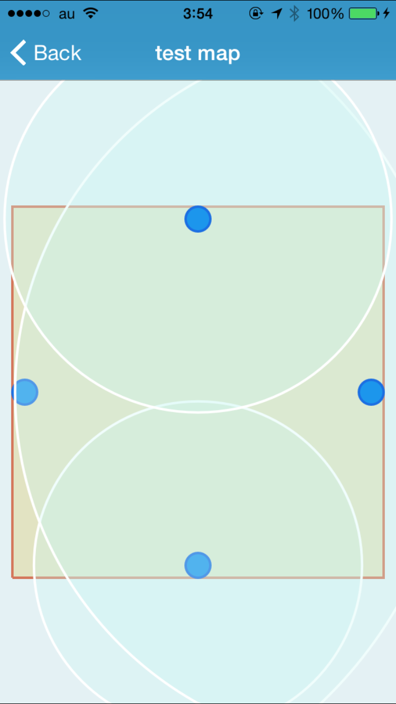

Title: タイトル
Author: @tboffice（著者名）

Title: iBeaconで簡単屋内測位
Subtitle: いつでもどこでも位置観測
Author: @saiten
Author(romaji): saiten

どうもこんにちは。そろそろMacbook Air(2011 Mid)に限界を感じてきているsaitenです。 Retina Macbook Airが出るまでガマンガマンと思っている間に3年も使い続けてしまいました。来年には出ると良いんだけどなー。

さて、今年も9月に新しいiPhoneが発売されました。昨年に引き続き同時に2台のiPhoneが発売されましたが、昨年がハイスペックモデルのiPhone 5Sと廉価版のiPhone 5C だったのに対して、今年は画面サイズの異なる[iPhone 6とiPhone 6+の2機種](http://www.apple.com/jp/iphone-6/)の発売となりました。iPhone 6、iPhone 6+ではディスプレイがコレまでに比べ巨大化し、様々な画面サイズを考慮しなくて良い、というAndroidアプリ開発に対するiOSアプリ開発のアドバンテージが大分失われてしまいました(それでもまだAndroidに比べれば少ないものですが)。画面サイズが大型化したもののUI設計には大きな変更はなく、片手では左上の戻るボタンを押せない等のいくつかの問題が発生しています。それに対するAppleの対策がTouch IDを2度タップすると画面が下がるという苦肉の策としかいえないもので、来年以降この辺りの問題をどう解決していくのか気になるところです。

また同時に[Apple Watch](http://www.apple.com/jp/watch/ なんでiWatchじゃないんでしょうかねー。)の発表も行われました。こちらはティム・クック体制となってからでは初となる「One More Thing」によるサプライズ発表で話題になりました。発表で紹介された使い方や機能が、他のスマートウォッチに比べて、またかつてのiPhoneに比べて革新的か？と言われるとまだまだ未知数な部分が多々あります。しかしこれは発売されて実際に触ってみてからの判断となるでしょう。先月11月には[WatchKit](https://developer.apple.com/watchkit/)も開発者向けに公開され、Apple Watch向けのアプリケーションの開発も行えるようになっています。まずは、iPhoneアプリの拡張機能という形でしか公開することはできませんが、来年後半にはApple Watch単体で動くネイティブアプリの開発も可能になっていることと思います。

さてさてそんなiOS界隈ですが、iOS7から導入された[iBeacon](https://developer.apple.com/ibeacon/)も公開からもうすぐ1年半ほど経つこともあり、iBeaconを活用した様々なアプリケーションが登場するようになりました。
O2O向けに店舗にビーコンを設置しオトク情報を提供したり、音楽のライブ等にビーコンを設置し限定コンテンツを入手できるようにするなどの使い方や、[玄関前にビーコンを設置しておくことで外出時に傘が必要かお知らせしてくれるアプリ](http://sorayoujin.feedtailor.jp/)のように、ちょっとしたアイデアで日常生活を便利にするような使い方を実現しています。

そんな中で先日JR東日本が東京駅にビーコンを160個設置し、駅構内をナビゲーションしてくれる[東京駅構内ナビ](http://www.jreast-app.jp/s-navi/)というアプリを公開しました。駅構内でアプリを起動すると自分の現在位置をマップ上に表示し、目的地までのルートをナビゲーションすることができるそうで、iBeaconを使った屋内マップアプリとしては日本では最大級のものかと思います。(注:執筆時点ではまだ公開実験前でどの程度の精度や性能なのかはわかりません。)

iBeaconではビーコンの検出だけでなく、そのビーコンの電波強度によってある程度の大まかなビーコンとの距離を測定することが可能です。この仕組みを使えば東京駅構内ナビのように屋内における位置測位アプリを開発できるかもしれません。

といったわけで前置きが長くなりましたが、今回はiBeaconを使った屋内における位置測位アプリを作ってみようと思います。

# iBeaconとは

ところでiBeaconって具体的に何者で、いったい何ができるんでしょうか？それについては[前回の私の記事を参照](https://sites.google.com/site/dai7sec/home/c85)してください。。。ではアレなので、簡単に説明しようと思います。

iBeaconはBluetooth 4.0 Low Energy (BLE)を利用してビーコンの検出、通信、距離検出を行うためにAppleが策定した規格です。アプリがiBeaconの規格に則ったビーコンとやりとりを行うためのライブラリをAppleが提供しているため、アプリ開発者は非常に簡単にiBeaconを使ったアプリの開発を行うことができます。iBeaconの規格自体はBLE上で実装されているため、BLEとのやり取りをおこなうことができれば、iOS端末だけではなく通常のMacやPC、Android端末(注:Android 4.3以降の機種のみ)からもiBeaconとの通信を行うことができます。

今回はこのiBeaconを利用した距離検出機能を使って、位置測位を実現するアプリを作るのが目標です。

# 屋内位置測位

そもそもなぜ屋内における位置測位の技術が必要なのでしょうか。位置測位システムとしては現在多くのスマートフォンにGPSが搭載され、屋外での位置測位にはほぼGPSが利用されています。しかしGPSは衛生からの電波を利用する都合上、屋根がある屋内や地下などでは正しい位置を測位できず利用することができません。また、GPSの位置測位は誤差が数ｍあるため、狭い室内などに用いるのは不向きです。

屋内でも巨大なショッピングモールや駅構内では、目標地までの距離や経路が複雑でナビゲーションを利用できれば便利ですし、屋内でユーザの位置情報が検出できれば色々なアイデアを実現することができます。そのため、屋内においてもGPSに依らずに屋内においてスマートフォンの位置測位を行う方法はiBeaconを利用する以外にもいくつか存在します。

1つはWiFiを利用する方法です。WiFiの電波もiBeacon(BLE)の電波と同じく、距離に応じて減衰しますので電波強度に応じて、どの程度アクセスポイントから端末が離れているかを測定することができます。WiFiの電波はiBeaconの電波に比べてより遠くに飛びますが、iBeaconよりも消費電力が大きく、あまり多くのアクセスポイントを設置できないのがネックです。しかし、WiFi電波を掴むことのできる端末ならどの端末でも対応できるため、対応できる範囲が広い方法と言えます。

もう1つは超音波を利用する方法です。特定のポイントから人間には聴き取れない高周波の音を発して、スマートフォンに付いているマイクを利用してその音波を受信し、音波の減衰量を元に超音波の発信元からの距離を算出します。こちらもマイクが付いてる端末であれば対応できるメリットがある一方、特殊な超音波発生装置が必要になります。

これらの方法に比べてiBeaconを利用することのメリットは、ビーコンが安価で比較的入手が容易なこと、消費電力が非常に小さいためボタン電池等で運用でき、設置場所を選ばないことが挙げられます。

# 作ってみよう

それではiBeaconを使った位置測位アプリを作っていきましょう。必要になるのは以下のものになります。

- 開発用のMac
- iOS Developer Program
- iBeaconに対応したiOS端末 (iPhone 4S、iOS7以降)
- 3つ以上のiBeacon

このうち上3つはまぁ皆さん持っていることでしょう（え、持ってないって？今すぐAppleにお布施してください）。ただiBeaconについてはあんまり持っている人はいないと思います。

iBeaconを手に入れる方法は色々ありますが、簡単なのは手持ちのiPhoneやMac等をiBeaconにしてしまうことです。Macであればnode.jsの[bleno](https://github.com/sandeepmistry/bleno)というライブラリを用いることで簡単にMacをiBeacon化することができます。

```
bleno = require 'bleno'

uuid = '15d47db18e5b41bdb43b017432741234'
major = 1
minor = 1
measuredPower = -59

bleno.startAdvertisingIBeacon uuid, major, minor, measuredPower
```

またiPhoneについても、以下の様なコードを実装することでビーコン化することができます。

```
NSUUID *uuid = [[NSUUID alloc] initWithUUIDString:kProximityUUID];
  
CLBeaconRegion *region = 
    [[CLBeaconRegion alloc] initWithProximityUUID:uuid
                                            major:1
                                            minor:1
                                       identifier:kIdentifier]; 
self.peripheralManager = 
    [[CBPeripheralManager alloc] initWithDelegate:self 
                                            queue:nil];
 
NSDictionary *advertisementData = 
    [region peripheralDataWithMeasuredPower:nil];
[self.peripheralManager startAdvertising:advertisementData];
```

こちらも簡単ですね。

ただ、今回は3つ以上のiBeaconが必要になる上、位置測位を行う部屋のあちこちにiBeaconを配置しなければならないため、専用のモジュールを利用します。今回はAplixのビーコンモジュールである[BM1](http://www.aplix.co.jp/?page_id=9666)の評価キットを利用します。ただ、このBM1は既に販売終了しているっぽいので似たような製品であれば、同じくAplixの[MB004](http://www.aplix.co.jp/?page_id=9463)を利用するとよいでしょう。BM1は単3乾電池2本で動作し、専用アプリから発信情報の変更などができることが特徴です。


## 位置測位手法

iBeaconの距離検出機能があることは先述したとおりですが、iBeaconからの距離だけが特定できたとしても、それだけではその端末が一体どこにあるのかはわかりません。あくまでiBeaconから特的できた距離半径のどこかにいる、ということが分かるだけです。


単体のiBeaconだけでは検出した距離の半径のどこかということしかわかりませんが、複数のiBeaconを組み合わせることでさらに位置を特定することができます。3つのiBeaconがあったとして、各ビーコンの位置についてはわかっている場合、あるiBeacon Aからの距離が2mでもう1つのiBeacon Bからの距離が1m、iBeacon Cからの距離が1.5mであった場合、それぞれの距離半径の円の交差する位置が端末の位置ということになります。


このように3つ以上のiBeaconからの距離測定が*正しく*行えれば、端末の位置を測位することができるはずです。

# 実装しよう

必要な物は揃ったのでどう作っていくかを検討していきましょう。今回は簡単化のため各辺が2mほどの正方形の部屋があると仮定して、部屋の各壁の中央に4つのiBeaconを設置して、アプリを入れたiPhoneが部屋のどの辺りにいるのかを測位して画面に表示するアプリを作っていきたいと思います。

## iBeacon情報

まずは事前に配置されているiBeacon情報をアプリに保持するため、これらの情報を管理するモデルクラスを作成する必要があります。IDLBeaconクラスを作成し、この中でiBeaconの位置やiBeaconの判定に利用するProximityUUID,major,minor番号を定義します。

```
@interface IDLBeacon : NSObject
@property (nonatomic, strong) NSString *name;   // ビーコン名
@property (nonatomic, assign) CGPoint position; // ビーコン位置

@property (nonatomic, strong) NSString *proximityUUID;
@property (nonatomic, assign) unsigned int major;
@property (nonatomic, assign) unsigned int minor;

@property (nonatomic, assign) CGFloat   accuracy; // 距離情報
@property (nonatomic, assign) NSInteger rssi; // 電波強度
@end
```

`position`には原点を(0,0)としてメートル単位でどの位置にそのiBeaconがあるかを格納しています。`proximityUUID`、`major`、`minor`には今回利用したBM1モジュールに定義されていた識別番号がそのまま格納し、iBeaconの識別に利用しています。

このIDLBeaconを4つ生成し、それぞれに各情報を設定します。

```
NSMutableArray *beacons = [NSMutableArray array];
for(int minor = 0; minor < 4; minor++) {
    IDLBeacon *beacon = [[IDLBeacon alloc] init];
    beacon.proximityUUID = IDLProximityUUID;
    beacon.major = 1;
    beacon.minor = minor;
    beacon.name = [NSString stringWithFormat:@"B(%d, %d)", beacon.major, beacon.minor];
    [beacons addObject:beacon];
}
    
((IDLBeacon *)beacons[0]).position = CGPointMake(-1,  0);
((IDLBeacon *)beacons[2]).position = CGPointMake( 1,  0);
((IDLBeacon *)beacons[1]).position = CGPointMake( 0,  1);
((IDLBeacon *)beacons[3]).position = CGPointMake( 0, -1);
```

## マップ情報

次に2m四方の壁を持つ部屋を定義します。部屋の情報を管理するIDLAreaクラスを作成し、この中で壁の情報とその部屋の中にあるIDLBeaconインスタンスを管理するように設定します。

```
@interface IDLArea : NSObject
@property (nonatomic, strong) NSString *name;
@property (nonatomic, strong) NSArray *wallPoints;
@property (nonatomic, strong) NSArray *beacons;
@end
```

`wallPoints`には壁の頂点座標を格納し、`beacons`にはこの部屋の中に存在するIDLBeaconのインスタンスを保持します。

IDLAreaクラスのインスタンスを生成し、壁の情報を設定して先ほど作成したIDLBeaconインスタンスを格納します。

```
IDLArea *area = [[IDLArea alloc] init];
area.name = @"test room";
area.wallPoints = @[[NSValue valueWithCGPoint:CGPointMake(-1,  1)],
                    [NSValue valueWithCGPoint:CGPointMake( 1,  1)],
                    [NSValue valueWithCGPoint:CGPointMake( 1, -1)],
                    [NSValue valueWithCGPoint:CGPointMake(-1, -1)]];
area.beacons = beacons;
```

## iBeaconの検出、通信開始

マップ情報の準備ができたので、iBeaconの検出と通信処理の開始処理を実装します。

iBeaconの監視を行う際にはまず`CLBeaconRegion`インスタンスを生成します。CLBeaconRegionには検出したいProximityUUIDをインスタンス生成時に指定する必要があり、ここでは先ほどIDLBeaconに設定したProximityUUIDを設定します。`CLBeaconRegion`インスタンスの生成後、CLLocationManagerの`startMonitoringForRegion`メソッドを使って、リージョンの検出を開始させます。なお、検出を止める場合は`stopMonitoringForRegion`メソッドを実行します。

なおこれらの処理を行う前に、iBeacon非対応の端末のためにiBeaconによるリージョン監視が行えるか確認しておくのがよいでしょう。

```
// iBeaconの監視に対応しているか
if(![CLLocationManager isMonitoringAvailableForClass:[CLBeaconRegion class]]) {
    return;
}
 
NSUUID *proximityUUID = [[NSUUID alloc] initWithUUIDString:IDLProximityUUID];
CLBeaconRegion *beaconRegion =
    [[CLBeaconRegion alloc] initWithProximityUUID:proximityUUID
                                       identifier:kIdentifier];

self.locationManager = [[CLLocationManager alloc] init];
self.locationManager.delegate = self;
[self.locationManager startMonitoringForRegion:beaconRegion];
```

リージョンの検出を始めてから、指定したリージョンに進入した際には、CLLocationManagerのdelegateに指定したインスタンスの`locationManager:didEnterRegion:`メソッドが呼ばれ、リージョンから退避した際には、`locationManager:didExitRegion:`メソッドが呼ばれます。

```
- (void)locationManager:(CLLocationManager *)manager 
         didEnterRegion:(CLRegion *)region {
    NSLog(@"did enter region : %@", region);
}
- (void)locationManager:(CLLocationManager *)manager 
          didExitRegion:(CLRegion *)region {
    NSLog(@"did exit region : %@", region);
}
```

リージョンの検出ができたら続いてiBeaconとの通信を行って距離検出を行うため、`CLLocationMnaager`の`startRangingBeaconsInRegion:`メソッドを実行します。このメソッド実行後、CLLocationManagerのdelegateの`locationManager:didRangeBeacons:inRegion:`が定期的に呼び出されるようになります。

```
- (void)locationManager:(CLLocationManager *)manager
         didEnterRegion:(CLRegion *)region {
    NSLog(@"did enter region : %@", region);
    if([CLLocationManager isRangingAvailable]) {
        [self.locationManager startRangingBeaconsInRegion:region];
    }
}
```

これによって1秒周期で`locationManager:didRangeBeacons:inRegion:`メソッドが呼び出されるようになります。`locationManager:didRangeBeacons:inRegion:`メソッドでは引数beaconsにCLBeaconインスタンスが含まれており、この中に距離情報等が格納されています。この距離情報を取出し、IDLBeaconインスタンスに反映させてやります。

```
- (void)locationManager:(CLLocationManager *)manager
        didRangeBeacons:(NSArray *)beacons
               inRegion:(CLBeaconRegion *)region {
    if(beacons.count > 0) {
        // Unknown(測定不能)のiBeaconを取り除く
        NSPredicate *predicate = [NSPredicate predicateWithFormat:@"proximity != %d", CLProximityUnknown];
        NSArray *validBeacons = [beacons filteredArrayUsingPredicate:predicate];
        
        for(IDLBeacon *beacon in area.beacons) {
            for(CLBeacon *clBeacon in validBeacons) {
                if([beacon.proximityUUID isEqualToString:clBeacon.proximityUUID.UUIDString] &&
                   beacon.major == clBeacon.major.intValue &&
                   beacon.minor == clBeacon.minor.intValue) {
                    beacon.accuracy = clBeacon.accuracy;
                    beacon.rssi = clBeacon.rssi;
                }
            }
        }
    }
}
```

これで位置情報を測位するための準備が出来ました。

## 複数のiBeaconから端末の位置を特定する

これまでの処理で各iBeaconからの端末の距離を求めることができたため、これを用いて端末がどの辺りにいるのかを求めます。各iBeaconと端末との距離を半径としiBeaconが設置してある位置をそれぞれの円の中心とすると、それぞれの円が交差する部分が出てきます。この円と円の交差を取得し、3つ以上の円が交差していた場合に、この交差の中心となる部分を円と円の交点から求めます。

```
// ビーコンから端末の位置を割り出す
- (CGPoint)_calculateIntersectionPointWithBeacons:(NSArray *)beacons
{
    NSMutableArray *intersections = [NSMutableArray array];
    for(int i = 0; i < beacons.count-1; i++) {
        IDLBeacon *b1 = beacons[i];
        for(int j = 0; j < beacons.count; j++) {
            IDLBeacon *b2 = beacons[j];
            NSArray *intersection = CircleIntersectionCircle(b1.position, b1.accuracy, b2.position, b2.accuracy);
            if(intersection) {
                [intersections addObject:intersection];
            }
        }
    }
    
    if(intersections.count > 1) {
        NSArray *line1 = intersections[0];
        NSArray *line2 = intersections[1];
        return LineIntersectionLine([line1[0] CGPointValue], [line1[1] CGPointValue], [line2[0] CGPointValue], [line2[1] CGPointValue]);
    } else {
        return CGPointZero;
    }
}

// 中心点p1、半径r1の円と中心点p2、半径r2の円の交点を求める。なければnil
static NSArray* CircleIntersectionCircle(CGPoint p1, CGFloat r1, CGPoint p2, CGFloat r2) {
    CGFloat d = sqrt(pow(p2.x - p1.x, 2)+pow(p2.y - p1.y, 2));
    
    if ((d >= (r1 + r2)) || (d <= fabs(r1 - r2))) {
        return nil;
    }
    
    CGFloat a = (r1 * r1 - r2 * r2 + d * d) / (2 * d),
    h = sqrt(r1 * r1 - a * a),
    x0 = p1.x + a * (p2.x - p1.x) / d,
    y0 = p1.y + a * (p2.y - p1.y) / d,
    rx = -(p2.y - p1.y) * (h / d),
    ry = -(p2.x - p1.x) * (h / d);
    
    return @[[NSValue valueWithCGPoint:CGPointMake(x0 + rx, y0 - ry)],
             [NSValue valueWithCGPoint:CGPointMake(x0 - rx, y0 + ry)]];
}

// (p1,p2)、(p3,p4)の線分の交点を求める。なければCGPointZero
static CGPoint LineIntersectionLine(CGPoint p1, CGPoint p2, CGPoint p3, CGPoint p4) {
    CGFloat d = (p2.x - p1.x)*(p4.y - p3.y) - (p2.y - p1.y)*(p4.x - p3.x);
    if (d == 0)
        return CGPointZero; // parallel lines
    CGFloat u = ((p3.x - p1.x)*(p4.y - p3.y) - (p3.y - p1.y)*(p4.x - p3.x))/d;
    CGFloat v = ((p3.x - p1.x)*(p2.y - p1.y) - (p3.y - p1.y)*(p2.x - p1.x))/d;
    if (u < 0.0 || u > 1.0)
        return CGPointZero; // intersection point not between p1 and p2
    if (v < 0.0 || v > 1.0)
        return CGPointZero; // intersection point not between p3 and p4
    CGPoint intersection;
    intersection.x = p1.x + u * (p2.x - p1.x);
    intersection.y = p1.y + u * (p2.y - p1.y);
    
    return intersection;
}
```

これでうまく距離検出ができた場合に、位置測位ができるようになりました。

# 実行結果

さて、早速実行してみましょう。分かりやすいように画面上にiBeaconの位置、壁、iBeaconからの推定距離を表示しています。



電波強度がコロコロ変わりなかなか安定しませんが、うまく落ち着いてくれるとそこそこ正確な位置を検出してくれます。


しかし、極端に特定のiBeaconに近づくとそのiBeaconの円が極端に小さくなり、他のiBeaconの円との交差がなくなり、とんでもないところをさしてしまうこともあるようです。もう少し改良が必要そうですね。。。


# まとめ

今回はiBeaconを使った位置測位に挑戦してみました。特定状況下ではそれなりに良い結果を出すことがあるものの、電波が安定せず、実用性という意味ではまだまだといった結果となりました。さらに他の方法を検討して再度チャレンジしたいところです。

