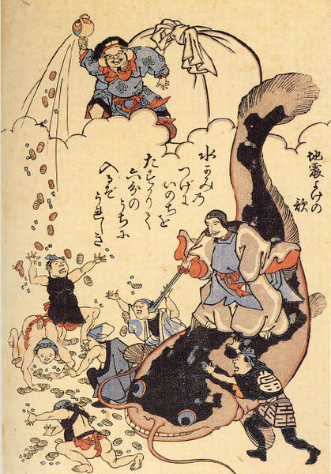
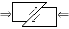

Title: そうだったのか！学べぬニュース わたなべ解説で炎上について学びましょう
Subtitle: 炎上について
Author: watanabe
Author(romaji): watanabe

# 炎上とは？

　炎上（えんじょう）とは、ソフトウェア開発活動を通じて超日常的・超現実的な社会状況を演出することによって、ソフトウェア開発に新しい価値を創造する超芸術活動のことを言います。

# 昔の人は炎上の原因をこう考えた

　日本では古来より「地中深くにウォーターフォール型開発が存在し、そのウォーターフォール型開発が暴れることにより大炎上が起きる」という俗説が信じられていました。その為か、一部の人々には今でもウォーターフォール型開発が暴れると炎上が来ると信じられています。江戸時代には安政の大炎上を期に「あぢやゐる」と呼ばれる開発手法が流行するなど、日本人にとって炎上とウォーターフォール型開発が身近な関係にあったことが伺えます。
　北欧神話においては地底に幽閉されたリーナストーパルズが、タネンバウムから降り注ぐ小言を浴びたときに周囲がエキサイトして炎上が起きるとされています。古代ギリシアでは、自然哲学者アナクシメネスが炎上の原因はピッチャーをデニーに代えることだと考えました。

# 炎上は境界線上で起こる

　近年の科学的研究の結果、炎上は各種の境界線上で発生することが明らかになりつつあります。

正常値　　境界値　　異常値

営業部　　PM　　開発部

嫁　　旦那　　姑

長男　　○○帆布　　三男

日本　　自称漁船　　中国

同盟　イゼルローン要塞　帝国

ヒロイン　　主人公　　幼馴染

Suica　　+offset　　PASMO

# 炎上が起こったらどうしたらよいのか？

　炎上がいつ発生しても適切な行動がを取れるよう、日頃から訓練を欠かさないようにしましょう。

1. メラッときたら身の安全を

   -  磐石な派閥や他部署の下に身をかくし、わが身を保護するようにしましょう

2. 落ち着いて非の始末をする

   - 非が出たら慌てずにもみ消しましょう
   - 小さな炎上でも非を消す習慣をつけましょう
   
3. あわてて社外に飛び出さない

   - むやみに社外に転職するのは危険です（周囲の状況をよく確かめて、落ち着いて行動しましょう）
   
4. 正しい情報で行動する

   - 炎上時はデマなどに惑わされやすくなります（2ちゃんねる・Twitterの情報に注意しましょう）

# 気象庁炎上階級

　気象庁炎上階級（きしょうちょうえんじょうかいきゅう）とは、炎上の大きさを表す炎上度階級で、主に気象庁が中心となって定めたものです。炎上がどれくらい涅槃の領域に近づいているかを、第三者に伝達するために用いましょう。

<table summary='表1::気象庁炎上階級'>
  <tr>
     <th>0</th>
     <th>人は炎上を感じない。品質管理部のみが炎上を記録する。</th>
  </tr>
  <tr>
     <td>1</td>
     <td>不具合やテストに敏感もしくは過敏な限られた一部の人が、炎上に気付く。</td>
  </tr>
  <tr>
     <td>2</td>
     <td>多くの人が炎上であることに気付き、転職活動中の人の一部は本腰を入れる。派遣会社から集めた開発者の契約更新率が人事部の想定範囲外程度の振幅巾で揺れる。</td>
  </tr>
  <tr>
     <td>3</td>
     <td>ほとんどの人が炎上を感じる。炎上の時間が長く続くと不安や恐怖を感じる人が出る。末端の開発者等の欠勤率があがる。</td>
  </tr>
  <tr>
     <td>4</td>
     <td>ほとんどの人が恐怖感をおぼえ、身の安全を図ろうとし始める。他部署の下に潜る人が現れる。転職活動中の人のほとんどが本腰を入れる。正規雇用ではないものは大きく揺れる。近接した担当者同士が揉めて騒ぎを立てる。立場の弱いPM等が倒れることがある。一部の出世コースは炎上発覚後停止する。その後大きな不具合がなければ自動で復旧するものが多い。</td>
  </tr>
  <tr>
     <td>5弱</td>
     <td>ほとんどの人が恐怖感をおぼえ、身の安全を図ろうとする。人生に支障が出始める。協力会社から集めた開発者を初め非正規雇用の多くが大きく揺れ、平社員の退職率が上がりはじめる。立場の弱い役員が身分から落下する。出世コースは停止し、経営陣が点検を行わなければ出世再開が不可能となる。</td>
  </tr>
  <tr>
     <td>5強</td>
     <td>恐怖を感じ、たいていの人が人生を再考する。社長とコネがあるなどの出世コースの中にあるものが落ちてくる。役員も役職から落ちることもある。一部の人が壊れたり、出社できなくなる。
出世コースは後ろ立てやコネが損傷し、地方支社に長期間飛ばされることもある。</td>
  </tr>
  <tr>
     <td>6弱</td>
     <td>勤務していることが困難になる。しっかりと固定していない役員の多くが動いたり転籍する。 来なくなる社員が多い。</td>
  </tr>
  <tr>
     <td>6強</td>
     <td>勤務していることができず､通院しないと動くことができない。
</td>
  </tr>
  <tr>
     <td>7</td>
     <td>告発や訴訟に翻弄され、自由意思で活動できない。ほとんどの役員が炎上にあわせて異動する。株式や権力を持っていない役員等、経営陣のうち数人程度の首が法廷を飛ぶことがある。</td>
  </tr>
</table>
